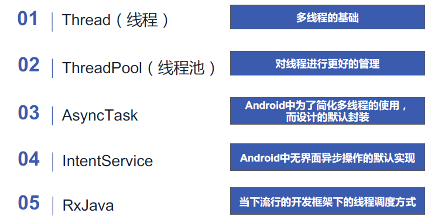
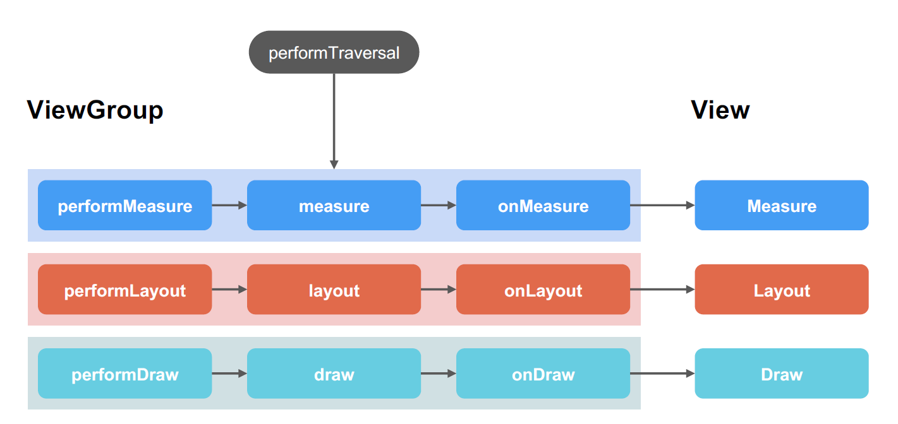
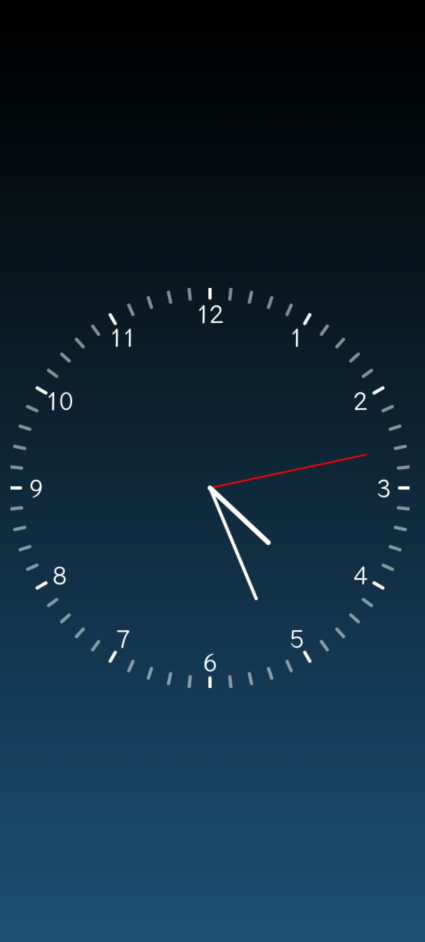
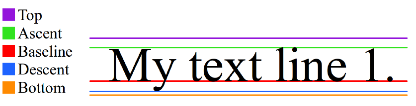
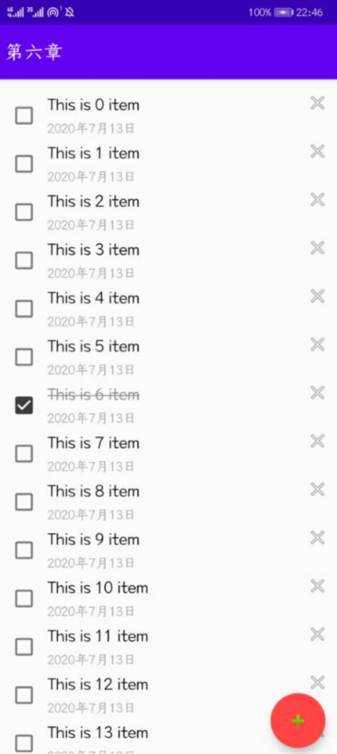
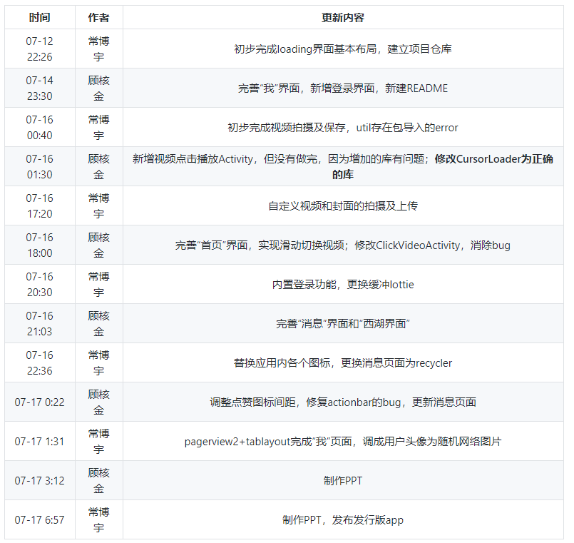
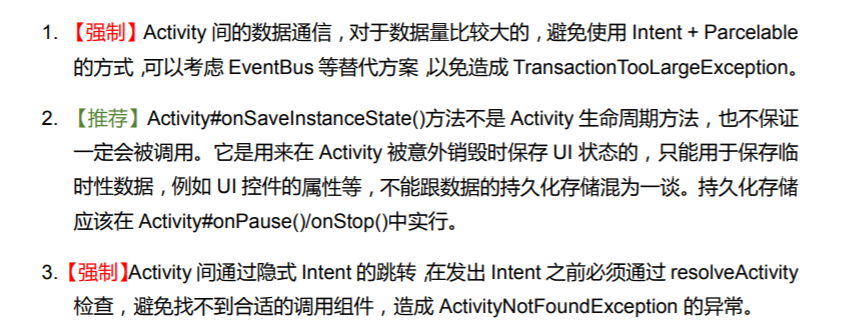

# README

2020.7.6\~2020.7.17的大二暑期小学期\~终于要学java和安卓开发了！XD

[toc]


### 环境配置说明

* demo项目sync报错unable to find valid certification path to requested target：修改项目级gradle里指定的IDE版本com.android.tools.build:gradle:x.x.x成自己的，然后把阿里云的链接换成google()和jcenter()，如果sync还是报错的话按提示修改项目级别gradle\wrapper下gradle-wrapper.properties里指定的gradle版本（在线状态，需科学上网）
* [如何更改Android Studio默认的C盘保存文件的设定](https://blog.csdn.net/Jeff_YaoJie/article/details/80499278?utm_medium=distribute.pc_relevant.none-task-blog-BlogCommendFromMachineLearnPai2-5.nonecase&depth_1-utm_source=distribute.pc_relevant.none-task-blog-BlogCommendFromMachineLearnPai2-5.nonecase)
* AS输出栏[方块字乱码解决方案](https://blog.csdn.net/zhang5690800/article/details/104502632)

## Chapter1

### 作业要求

* 进行Android Studio、git的安装与环境配置
* 利用不少于5个组件编写一个DEMO，并将交互结果输出到log

### 作业成果


### 总结

其中最麻烦的是配置Gradle，我的电脑连打开demo都会failed。

采用在线gradle，主路径按.gradle下属init.d的初始化文件，修改目标路径为指定路径

并 不指定具体地址

最后实现了gradle没有报错（真机调试）

[关于修改默认路径（从C盘改到其他盘）的方式](https://blog.csdn.net/Jeff_YaoJie/article/details/80499278?utm_medium=distribute.pc_relevant.none-task-blog-BlogCommendFromMachineLearnPai2-5.nonecase&depth_1-utm_source=distribute.pc_relevant.none-task-blog-BlogCommendFromMachineLearnPai2-5.nonecase)

[初次coding推荐阅读官方文档](https://developer.android.google.cn/training/basics/firstapp/running-app)

## Chapter2

### 课程简要提纲

* 三种布局：线性布局、相对布局、帧布局（用于图片重叠）
* 图片imageview的scaletype属性可以设置图片的填充方式
* 使用toast创建弹出提示
* recycleview：只对屏幕显示的内容进行加载，并实现内存复用，可以优化性能，避免崩溃
* intent可以用于不同activity之间的信息传递与唤起，也可以拿到返回值，有显式和隐式两种
* 创建Acitivity要new一个activity，不要手动创建class然后手动添加xml、更新manifest

### 课程作业

* 实现一个RecyclerView，要求点击条目可以跳转至新的activity，并传递这是第几个item的信息
* 统计⻚⾯所有view的个数。ViewGroup中的API：getChildCount() ：获取该group下的孩子数。getChildAt()：获取第i个孩子

### 作业成果


### DEBUG

* 使用intent启动activity的时候注意manifest有没有说明这个activity，否则闪退
* setText（）接受字符串时是更改内容，如果传入数字会throw new RuntimeException("Stub!")；所以需要Integer.toString转字符串

## Chapter3

### 课程提纲

* fragment：解决了activity需要因为手机和平板不同而重写的问题。将activity视作fragment的容器
* fragment增强了代码重用性，与activity极其相似，并具有生命周期
* 一般使用属性动画，因为补间动画只是视觉效果。很少使用帧动画。
* 一类有趣的动画：[lottie](https://airbnb.io/lottie/#/android?id=from-resraw-lottie_rawres-or-assets-lottie_filename)
* [属性动画的资料说明](https://www.jianshu.com/p/2412d00a0ce4)

### 课程作业

* 完成使用进度条控制lottie动画的TODO
* 使用代码方式制作属性动画，实现大小（scaleX、scaleY）的缩放、透明度（alpha）的变化
* 拓展作业：利用viewpager实现多fragement的滑动切换，利用tablayout添加tab切换功能

### DEBUG

* 使用getSupportFragmentManager().beginTransaction().add(id,new fragment()).commit();的时候，id获取到的container不能和new fragment使用的container相同，否则会闪退
* 属性动画的ofInt（如backgroudcolor）、ofFloat等需要额外学习，其中第二个参数是字符串，没有自动补全，但是任意输入则报错。修改属性时可以点进xml搜索attributes查找可用的属性名称
* 关于viewpager2与tablayout[可以参考](https://blog.csdn.net/Utzw0p0985/article/details/103676010)，以及[这个](https://juejin.im/post/5df4aabe6fb9a0161104c8eb) ,其中TabLayoutMediator无法使用的原因是自动添加的gradle采用的是materials1.0.0版本，手动改成1.1.0版本即可使用。

## Chapter4

### 课程提纲

* 线程被start后通过实现的run方法进行执行，执行完毕后被销毁
* 线程池：执行提交的任务，解耦任务的提交与执行，封装线程使用与调度的细节。

* synctask：安卓sdk提供
* intentservice也可以启动线程



* ViewGroup的绘制过程如下，其中onMeasure、onLayout、onDraw是需要重写的关键函数

 

### 课程作业

* 根据数学关系，计算秒针、分针、时针的角度关系，绘制指针
* 在给定的表盘中绘制数字
* 添加秒针的跳动效果

### 作业成果



### 总结

* Paint的setAntiAlias(true);用于平滑画笔边缘，抗锯齿；setStrokeWidth用于设定画笔粗细；setStrokeCap用于设定每个画笔落点形状；setStyle用于设定填充方式（外描边、填充、外描边+填充）；setTextAlign设定文本对齐方式；setTextSize设定字体大小（65f比较美观）



文字绘制时，采用Paint.FontMetrics fontMetrics = numberPaint.getFontMetrics(); 各值与设定的size有关。获取metrics。baseline在metrics名为leading，其值为0，是基准线。其他四种线在metrics都有定义，是相对于基线的Y轴偏移量（下为正方向）。从图中表示的话，top = 紫线Y坐标减红线Y坐标，Bottom = 黄线Y坐标减去红线Y坐标，以此类推。如果想把文字中心对齐，需要使用预先计算出textY，然后textY + (bottom - top) / 2 - bottom即可。然后drawText四个参数分别为绘制的文本、起始X坐标、基线坐标、画笔。

*  getWidth(), getHeight()用于获取view的宽高
* 两个重要函数：invalidate(如果布局没变化，只触发draw），requestLayout(触发layout、measure)
* handler的三种使用方法：新建handler并实现handleMessage方法，可以调度thread；直接new一个runnable实现直接调度runnable；通过handler取消已经发送的massage或runnable
* runnable实际上会被打包成message。主线程不能执行耗时较长的任务，否则ANR，应用无响应。

## Chpater5

### 课程提纲

* 网络基础知识

### 课程作业

* 在程序框架基础上完成照片、视频上传与获取功能

### 总结

* 作业只需要加三个函数调用就行。虽然比较水，但是这个DEMO的框架可以应用到最后的大作业上

## Chapter6

### 课程提纲

* room对sqlite数据库进行封装

### 课程作业

* 完成一个TODO应用，在框架的基础上拓展添加记录、删除记录、标记已完成的功能

### 作业成果



### 总结

* 这次作业工作量稍大，而且需要用到对[item内部控件进行操作](https://blog.csdn.net/qq_38225558/article/details/80608527)的技术：可以学习一下java的“接口”的概念
* 关于使用[room对来封装数据库的相关操作](https://www.jianshu.com/p/7354d5048597)  [关于版本升级](https://blog.csdn.net/yonghuming_jesse/article/details/98037118?utm_medium=distribute.pc_relevant.none-task-blog-BlogCommendFromMachineLearnPai2-1.nonecase&depth_1-utm_source=distribute.pc_relevant.none-task-blog-BlogCommendFromMachineLearnPai2-1.nonecase)
* [文字样式之删除线](https://www.jb51.net/article/136661.htm)
* 取消checkbox的点击动画：android:background="@android:color/transparent"

## Chapter7

### 课程提纲

* 图片基础知识
* 视频基础知识

### 课程作业

* 开发一个可以展示图片、可以播放视频的APP
* 1、使用Glide展示网络图片
  * 加载中、加载失败时有占位图
  * 实现图片圆角功能（可选）
  * 渐变展示（可选）
* 2、播放网络视频
  * 播放、暂停功能
  * 播放进度条展示（包括时间显示）
  * 进度条可以点击、滑动，跳转到指定位置（可选）
  * 横竖屏切换、横屏时展示全屏模式（可选）
  * 将app注册为播放器类型(Action为ACTION_VIEW，Data为Uri，Type为其MIME类型)，点击打开系统视频文件时，可以选择使用自制播放器；（可选）

### DEBUG

* [随机获取一张图片](https://uploadbeta.com/api/pictures/random/)  这个网站的[API说明](https://uploadbeta.com/picture-gallery/faq.php#api) 
* 强制设定glide不采用缓存文件

```java
 Glide.with(AddComActivity.this)
                    .load(imgSave)
                    .skipMemoryCache(true)//跳过内存缓存
                    .diskCacheStrategy(DiskCacheStrategy.NONE)//不要在disk硬盘缓存
                    .into(imgAddCom);
```

* [videoview来处理视频播放问题](https://www.cnblogs.com/plokmju/p/android_VideoView.html)
* [关于处理横竖屏的方式](https://blog.csdn.net/zhuziyue1202/article/details/51501692)
  * 在manifest设定screenOrientation可以阻止横竖屏
  * 在manifest设置android:configChanges="orientation|screenSize"可以以自定义函数方式来处理横竖屏

```java
@Override
public void onConfigurationChanged(Configuration newConfig) {
    super.onConfigurationChanged(newConfig);

    if (newConfig.orientation == Configuration.ORIENTATION_LANDSCAPE) {
        Toast.makeText(this, "landscape", Toast.LENGTH_SHORT).show();
    } else if (newConfig.orientation == Configuration.ORIENTATION_PORTRAIT) {
        Toast.makeText(this, "portrait", Toast.LENGTH_SHORT).show();
    }
}

```


* 复习一下handler的使用方式

```java
Handler handler = new Handler(); // 先创建一个Handler对象
handler.postDelay(new Runnable...).start(); // 以延迟调用为例，如果runnable又调用postDelay，则循环。
```

* 本来采用wrap_content包装videoview导致播放前整个盖满（在宽度match_parent），但是在onCreate添加videoView.setVideoPath(getVideoPath(R.raw.tokyo_university));以后反而自动调整高度大小了，就很奇怪。
* [Acitivity使用的intent实例](https://www.cnblogs.com/guop/p/5067342.html)

## Chapter8

### 课程提纲

* 介绍调用系统相机、系统录制
* 介绍自定义相机、自定义录制

### 课程作业

* 完成一个自定义录制，支持变焦、闪光灯、暂停、延迟录制

### DEBUG

* 原有的android.hardware.Camera类已经被废弃，[新的Camera2](https://www.jianshu.com/p/73fed068a795)  [相关说明](https://blog.csdn.net/hexingen/article/details/79290046)

## 课程大作业

两人组队，实现一个Mini抖音

### 设计思路

* 开机动画：设定SplashActivity为启动时调用的活动，其布局文件采用一个居中显示lottie的加载页面。在onCreate设置延迟2秒的Handler，发送空Intent给MainActivity，并finish销毁自己，防止用户返回上一级时直接返回动画页面。
* MainActivity：下方状态栏采用[自定义样式的单选按钮组](https://www.jianshu.com/p/0b9d5777abba)，上方放一个FrameLayout当做碎片的容器。

### DEBUG

* 获取文件路径log总是没有提示，以为是语法没学好，静态函数需要创建类实例？实际上是筛选log的时候加了TAG限定MainActivity，结果那个函数是另外一个类的……吐血了
* 不知道为什么，练习题的时候可以正常读取本地照片和视频的绝对路径，但是大作业就会返回空地址，即便是使用相同的fileutils，内部返回的cursor也不一样……最后选择了现拍现用的方法
* login放里面返回后不能被onresultActivity捕获：不要新建intent，用getintent获取发送来的intent再setresult

## 课程总结

十天的密集训练结束了……回想那段每天从早上忙到晚上的生活，仿佛刚刚发生在昨天（好吧就是昨天）确实学到了很多新的东西，但更感觉像是打开了新世界的大门，还有很多宝藏等待自己挖掘，接下来的路才刚刚开始呐！总结而言最后的大作业确实应该从第二天开始做，每天都把新增的部分加到大作业里，不然最后这一点时间只能把之前的小实验拼成大作业，没有时间做拓展了（但是实际上之前的小实验也能一做一天啊喂！）。最后大作业也太赶了，进度如下↓



## 课外学习

### Java基础知识补充

学安卓开发需要前置java基础知识。Kotlin是在Java基础上改写，与其100%相容，而更加注重健壮性，小学期过去后就是用kotlin来做Android开发吧。

### Intent

* Intent可以用于活动之间的消息传递，可以分为显式Intent和隐式Intent两种，创建方法Intent mIntent = new Intent（···）
  * 显式创建时在new Intent里指定发送方上下文与想要启动的目标活动，例如 new Intent(xxxActivity.this, xxxx.class) 注意需要在manifest里注册相关activity。
  * 隐式创建的功能更为强大，可以通过过滤器对符合条件的Intent进行调用，可以是其他应用的activity。对应的Intent的构造函数需要传入一个参数，表示action（此时category表示DEFALUT）。比如new Intent(Intent.ACTION_VIEW)，然后可以通过addCategory添加类别。（一个activity可以设定多个类别）。举例在设定action.view后，设定setData(Uri.parse("http://xxxxx"))；然后startActivity(mIntent)可以直接打开浏览器对应网址，不需要自己写什么别的活动。ACTION_VIEW是安卓内置动作，类似的还有ACTION_DIAL

* 利用Intent进行传值时，发送方可以使用putExtra（键，值）添加信息，接收方先使用getInent（）获取接收到的Intent，然后再根据想要拿到的类型，调用getStringExtra（键）获取字符串信息，getIntExtra（键）获取整型信息，等等。
* 利用Intent获取值是，发送方使用startActivityForResult（intent，code）来启动一个活动，在对应活动里也要创建一个Intent，然后putExtra赋值等任务结束后，使用setResult（RESULT_OK/RESULT_CANCEL, intent）对活动结果进行记录，最后finish()销毁这个活动。销毁后，会自动调用发送方的onActivityResult(int requestCode, int resultCode, Intent data)方法（因此需要重写这个函数）。此函数requestCode是发送方在之前设定的code，resultCode是接收方setResult设定的结果，data就是接收方发送的intent。此函数内部需要对requestCode进行switch，判断是发送方哪个intent的返回结果，然后对resultCode进行判断，再执行其他任务。注：如果接受者没有按预期情况返回（比如没有按预期的按钮返回，而是点击了后退按钮），可以重写onBackPressed方法来执行相同内容。

### Activity 

#### 生命周期、回调方法、生存期

Activity共有7个回调方法，生命周期有6个阶段，可分为四种状态（运行、暂停、停止、销毁）与三个生存期（完整生存期：onCreate-onDestroy；可见生存期：onStart-onStop；前台生存期：onResume-onPause）

* onCreate方法，需要重写，在活动第一次被创建时调用。这个方法应当完成布局加载、事件绑定等初始化操作
* onStart方法，在活动由不可见变为可见时调用
* onResume方法，在活动准备好和用户交互时调用，此时活动位于返回栈的栈顶，并处于运行状态
* onPause方法，在系统准备启动或恢复另一个活动时调用，一般在此方法中释放消耗CPU的资源，并保存关键数据。此方法执行速度应尽可能快，否则影响新栈顶活动使用
* onStop方法，在活动完全不可见时调用
* onDestroy方法，在活动被销毁前调用，在此方法内完成内存释放
* onRestart方法，活动由停止态变为运行态时调用

如果活动A调用活动B，并被完全遮盖，那么A进入停止态。如果此时内存不足A被回收，那么B返回后则会create一个A。但这个A不会保存原来A的临时变量，严重影响用户体验。为解决这一问题，需要重写A的onSaveInstanceState方法，注意到onCreate默认传参就是savedInstanceState。这个参数是一个Bundle类型，使用putString（键）/putInt（键）/getSteing（键）等等方法来读写数据

以下是阿里安卓开发手册部分截图



#### 启动模式

manifest可以指定活动的四种启动方式：standard、singleTop、singleTask、singleInstance，对活动创建的方式进行了设定，getTaskID（）函数可以获取当前使用的返回栈的id

* standard方式：不管返回栈有无当前活动，只要向此活动发送intent，就create一个新的活动，并加入返回栈
* singleTop方式：向此活动发送Intent时，如果该活动在栈顶，则不create
* singleTask方式：向次活动发送Intent时，通过适当的入栈出栈来到唯一的活动（保证栈内只有这种活动的一个实例）
* singleTask方式：此活动将创建自己的返回栈，以便于独立管理（共享栈）

#### 其他

* ```java
  //隐藏顶部自带的标题栏
  ActionBar mActionBar = getSupportActionBar();
  if (mActionBar != null) {
      mActionBar.hide();
  }
  ```

###  参考资料

1. 《我的第一行代码》