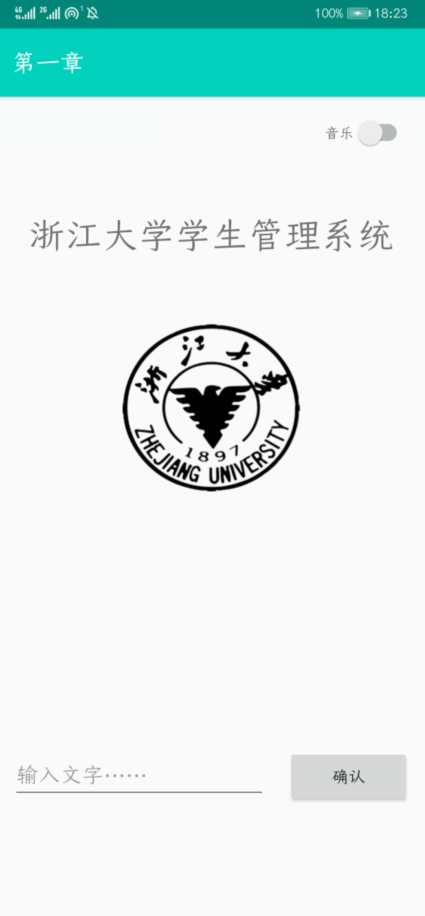
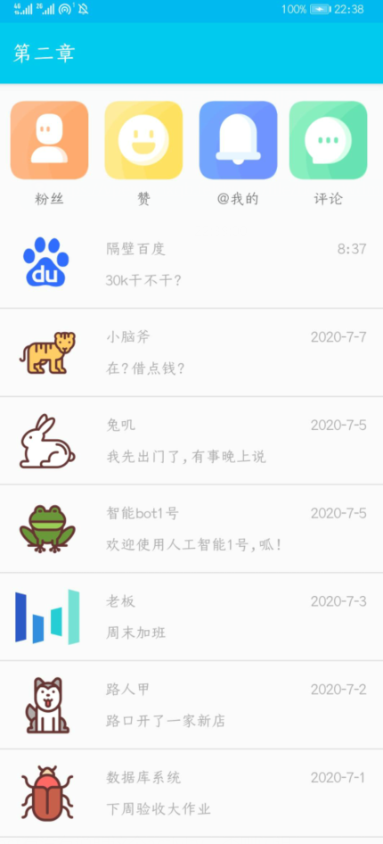

# README

2020.7.6\~2020.7.17的大二暑期小学期\~终于要学java和安卓开发了！XD

## Chapter1

### 作业要求

* 进行Android Studio、git的安装与环境配置
* 利用不少于5个组件编写一个DEMO，并将交互结果输出到log

### 作业成果

### 总结

其中最麻烦的是配置Gradle，我的电脑连打开demo都会failed。

采用在线gradle，主路径按.gradle下属init.d的初始化文件，修改目标路径为指定路径

并 不指定具体地址

最后实现了gradle没有报错（真机调试）

[关于修改默认路径（从C盘改到其他盘）的方式](https://blog.csdn.net/Jeff_YaoJie/article/details/80499278?utm_medium=distribute.pc_relevant.none-task-blog-BlogCommendFromMachineLearnPai2-5.nonecase&depth_1-utm_source=distribute.pc_relevant.none-task-blog-BlogCommendFromMachineLearnPai2-5.nonecase)

[初次coding推荐阅读官方文档](https://developer.android.google.cn/training/basics/firstapp/running-app)

## Chapter2

### 课程简要提纲

* 三种布局：线性布局、相对布局、帧布局（用于图片重叠）
* 图片imageview的scaletype属性可以设置图片的填充方式
* 使用toast创建弹出提示
* recycleview：只对屏幕显示的内容进行加载，并实现内存复用，可以优化性能，避免崩溃
* intent可以用于不同activity之间的信息传递与唤起，也可以拿到返回值，有显式和隐式两种
* 创建Acitivity要new一个activity，不要手动创建class然后手动添加xml、更新manifest

### 课程作业

* 实现一个RecyclerView，要求点击条目可以跳转至新的activity，并传递这是第几个item的信息
* 统计⻚⾯所有view的个数。ViewGroup中的API：getChildCount() ：获取该group下的孩子数。getChildAt()：获取第i个孩子

### 作业成果

### DEBUG

* 使用intent启动activity的时候注意manifest有没有说明这个activity，否则闪退
* setText（）接受字符串时是更改内容，如果传入数字会throw new RuntimeException("Stub!")；所以需要Integer.toString转字符串